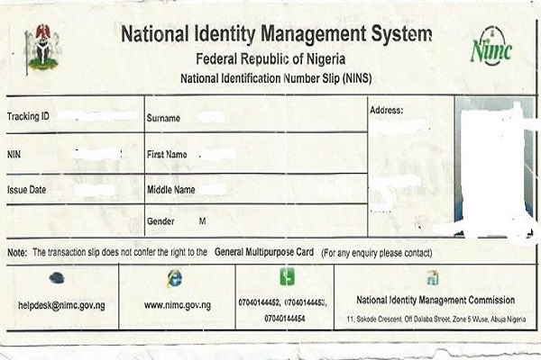
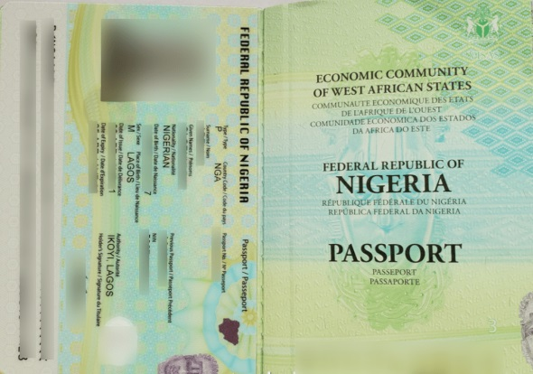
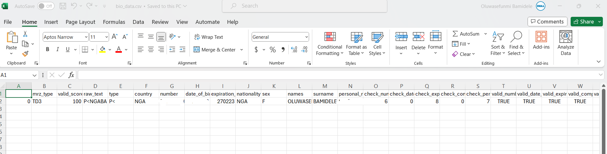

# Identity Verification library


## Introduction :slightly_smiling_face:

The sole purpose of updating this project is because most credit cards do not come with names, talkless of full names, and even if they do, comparing just a name on credit/debit cards with an international passport defeats the purpose of this project, which is creating seamless/ automated means of verifying identity.

So, I came up with another way to resolve this by using the National Identity Number - NIN slip and the International passport. I used the slip because most people do not have NIN ID, but it’s not to at least have the slip, which is the paper format.

Again, most people do not have high-quality camera phones and even if they do, it’s hard to get good angles and lightning pictures that a model can extract text from, correctly.
So, to bypass all these limitations, I decided to use the slip which is the most common and less complex.

I also intend to use this project to learn how to communicate my findings better here on Git Hub. This project showcases my Python programming skills for image and text preprocessing, and algorithm writing. I hope it is worth it at the end of the day.


## Problem Statement :cry:


The problem here is how to verify the identity of a person via an international passport and a NIN slip.
Does the passport and the NIN slip belong to one person? To answer this, we need to answer the following questions:

- Are the names the same? We will compare the first, middle, and last names.
- Are the NINs the same? The NIN from the NIN slip and the NIN from the International passport.
- Do they have the same sex/gender?

These 3 questions will be graded accordingly and if the mark is greater than 0.90, then it’s a match, else it is not.
_Kindly note that we are trying to verify the identity of the owner of the international passport. The international passport has NIN record in its data. All we need do is compare this number to the number on the NIN slip, alongside the name and sex. So, the person needs to provide his/her NIN slip for this verification._


## Computer Vision/ Image Processing Libraries used ⚙️ :

1. Pandas
2. Passporteye - to extract the MRZ code from a passport
3. Pytesseract - To extract text from an image.

*NB*: MRZ is the long alphanumeric code at the bottom of your passport; make sure every part of this code is captured in your image


## Data Sourcing 🕳️:

After establishing the problem, I got an international passport and NIN slip that belonged to the same person, extracted the information on the NIN slip scanned image using Pytesseract, and extracted the international passport's information, using the MRZ code captured by the passporteye library, and then compared both.

NIN Slip Sample                            |                International Passport Sample
:------------------------------------------------------------:|:--------------------------------------:
 | 


## Image Preprocessing, Data Extraction, and Data Comparison

Created a class of 4 methods/functions, namely;

### The initiating function
Popularly known as the “_init_”, was where I initiated the constant variables needed for this project.

### The extracting function - _extract_passport_
This was where the passport data was extracted.

*steps:*
- Extract full data using passporteye library.
- Save data into a dictionary.
- Save a copy of full data to a csv file.
- Return the essential data (full name, NIN, sex) needed for comparison.

```
def extract_passport(self, passport):
  from passporteye import read_mrz
  self.passport = passport
  self.mrz = read_mrz(self.passport, save_roi=True)
  self.mrz_data = self.mrz.to_dict()
  data_ = []
  data = dict(self.mrz_data)
  data_.append(data)
  print(data_)
  self.df = pd.DataFrame(data_)
  self.df.to_csv('bio_data.csv')
  print(self.df)
  self.name = self.mrz_data['names'] + ' ' + self.mrz_data['surname']
  nin = self.mrz_data['personal_number'].split('<')[0]
  nationality = self.mrz_data['nationality']
  sex = self.mrz_data['sex']
  self.data = {'full_name' : self.name, 'nin': nin, 'sex': sex}
  print(self.data)
  return self.data
```

### The extracting function2 - _ocr_core_
This was where I extracted the details of the NIN slip.

*steps:*
- extract full data by converting the image to string using the pytesseract library.
- cleanse the data using functions such as strip, split, and replace.
- return the essential part of data (full name, NIN, sex) needed for comparison

```
def ocr_core(self, nin_slip_image):
    self.nin_slip = nin_slip_image
    try:
        from PIL import Image
    except ImportError:
        import Image
    import pytesseract
    import re
    img = Image.open(self.nin_slip)
    img = img.convert("L")
    
    self.text = pytesseract.image_to_string(img)
    self.text = self.text.split(':')[3:][:-1]
    surname = self.text[0].strip().replace('\n\n', ' ').split(' ')[1]
    nin = self.text[1].strip().split()[0]
    fname = self.text[2].replace('\n\n', ' ').split()[0]
    mname = self.text[4].replace('\n\n', ' ').split()[0]
    sex = self.text[5].replace('\n\n', ' ').split()[0]
    name = fname+ ' '+ mname+ ' '+ surname
    self.text = {'full_name': name, 'nin': nin, 'sex': sex}
    print(self.text)
    #self.text = re.sub('[^A-Z\s]+', '', str(self.text))
    #self.text = re.sub('\s+', ' ', str(self.text))
    return self.text
```

### The comparing function - compare_data
This is the function that compares the responses gotten from the separate functions above, using the intersection cardinality and union cardinality.

- *Intersection cardinality* : is a function that returns the differences between the two sets.
- *Union cardinality*: as the name implies, returns everything in both sets.
- *score* = $(A n B) / (A u B)$
- *match*: $score >= 0.90$ (a threshold greater than or equal to 90)

*steps:*
- call the _extract_passport_ function to extract passport's data.
-  call the _ocr_core_ function to extract NIN slip's data.
-  compare data/responses
-  if there is a match, return the following:
  1.  "MATCH"
  2.  its calculated score
  3.  the full passport data.
- else, if no match, return the following:
  1. "NO MATCH"
  2. its calculated score
  3. an empty string - ""


 ```
        def compare_data(self,):
  
          mrz_data = self.extract_passport(self.passport)
          data = self.ocr_core(self.nin_slip)
          intersection_cardinality = len(set.intersection(*[set(mrz_data), set(data)]))
          union_cardinality = len(set.union(*[set(mrz_data), set(data)]))
          result = intersection_cardinality / float(union_cardinality)
          if result >= 0.90:
      
              return (f"MATCH : {result}", self.df)
          else:
              return (f"NO MATCH : {result}", "")
```    


A sample of full data: kindly know that some details were blurred out.




## Conclusion :
- In less than 5 seconds, you are able to compare data and porbably also get data if there is a match :nerd_face:.


